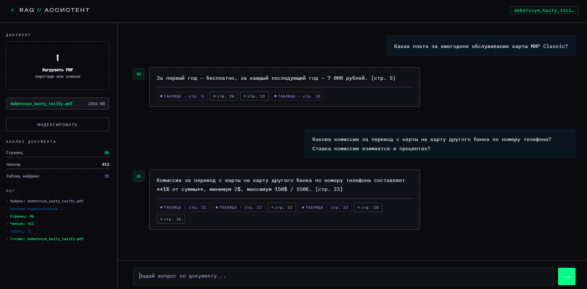

# RAG Assistant

> Загрузите документ — задайте вопрос. Ответ строго по содержимому файла.



[English version](README.en.md)

---

## Содержание

- [Возможности](#возможности)
- [Быстрый старт](#быстрый-старт)
- [CLI](#cli)
- [Переменные окружения](#переменные-окружения)
- [Требования](#требования)

---

## Возможности

- **Форматы:** PDF, DOCX, TXT, MD
- **Гибридный поиск:** BM25 + векторные эмбеддинги
- **Умное чанкирование:** parent-child стратегия, таблицы не разрезаются
- **Кэш на диске:** эмбеддинги сохраняются между сессиями
- **Генерация ответов:** GigaChat

---

## Быстрый старт

```bash
git clone https://github.com/username/rag-assistant.git
cd rag-assistant

python -m venv .venv
source .venv/bin/activate        # Windows: .venv\Scripts\activate

pip install -r requirements.txt

cp .env.example .env             # укажите GIGACHAT_CREDENTIALS

python main.py serve
```

Откройте [http://localhost:8000](http://localhost:8000)

---

## CLI

Индексация документа:

```bash
python main.py index document.pdf
```

Вопрос по документу:

```bash
python main.py ask document.pdf "Какая комиссия?"
```

---

## Переменные окружения

Скопируйте `.env.example` в `.env` и заполните:

| Переменная | Описание |
|---|---|
| `GIGACHAT_CREDENTIALS` | Ключ доступа к GigaChat API |
| `LOCAL_EMBEDDING_MODEL` | Название модели эмбеддингов |
| `USE_RERANKER` | Использовать реранкер: `true` / `false` |

---

## Требования

- Python 3.11+
- Зависимости: `requirements.txt`
